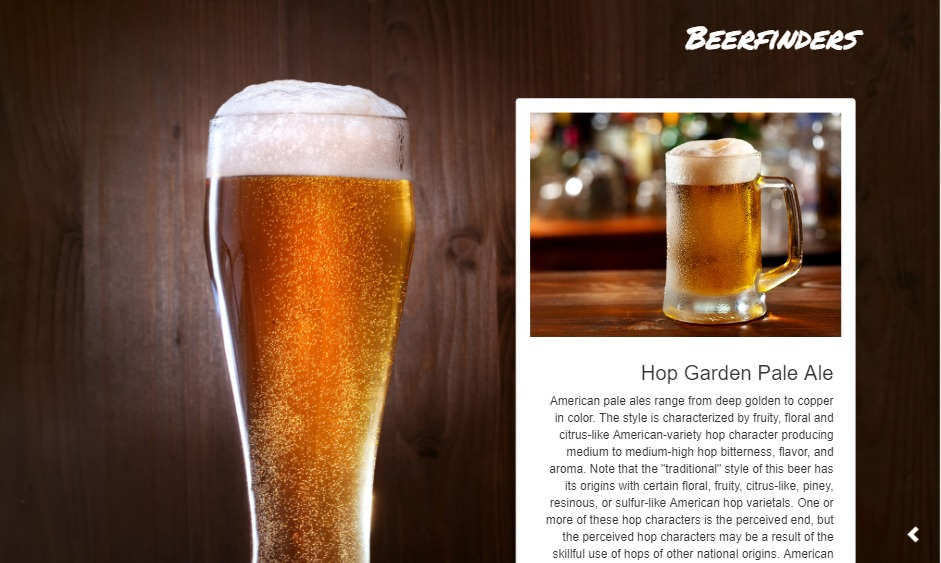

# [Beerfinder](https://devtoni.github.io/beerfinder/) #

## Description

Beerfinder is a responsive web app built with HTML, CSS and jQuery as part of curriculum from Skylab Coders Bootcamp.

This app helps you to find any beer brand and a concret model.

